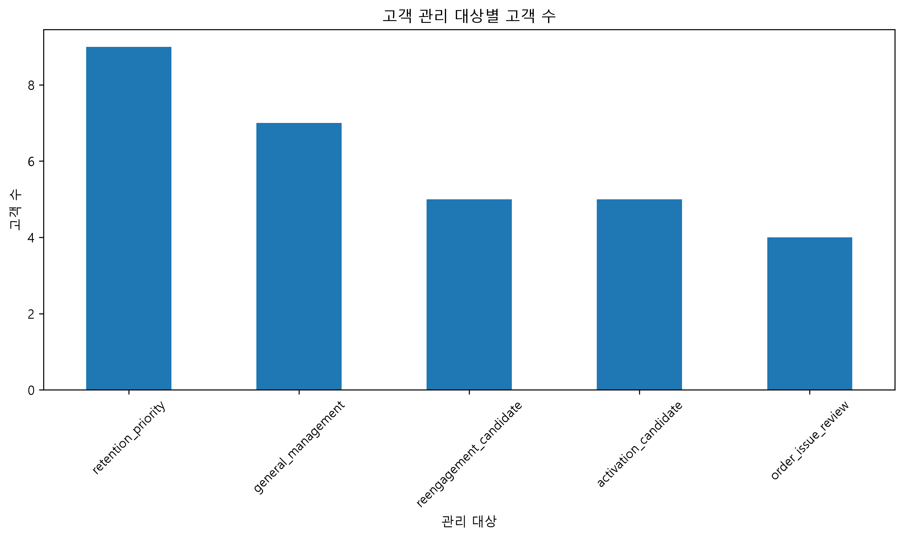
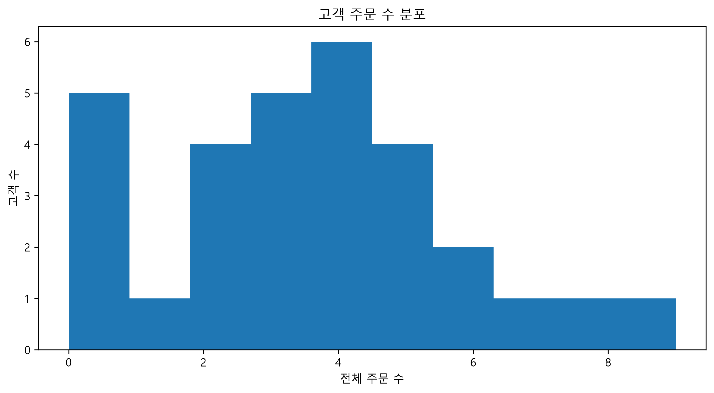
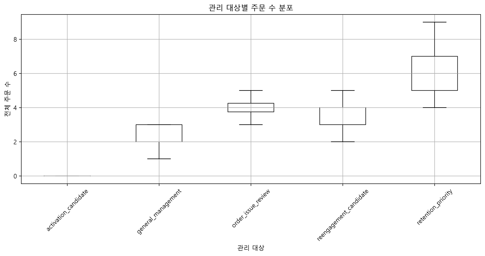
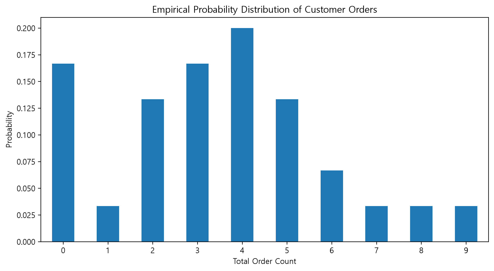
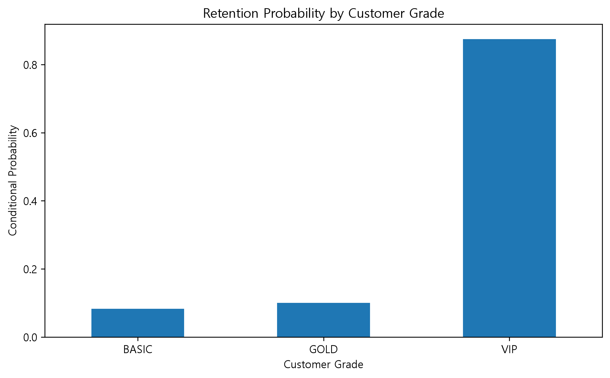
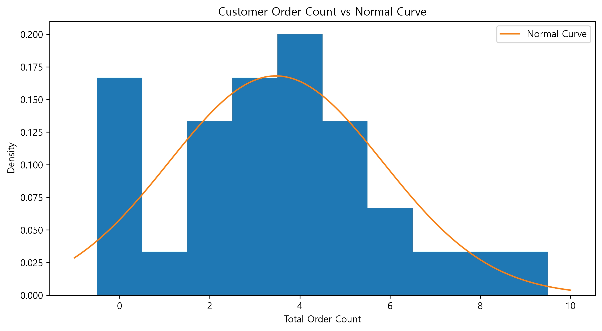
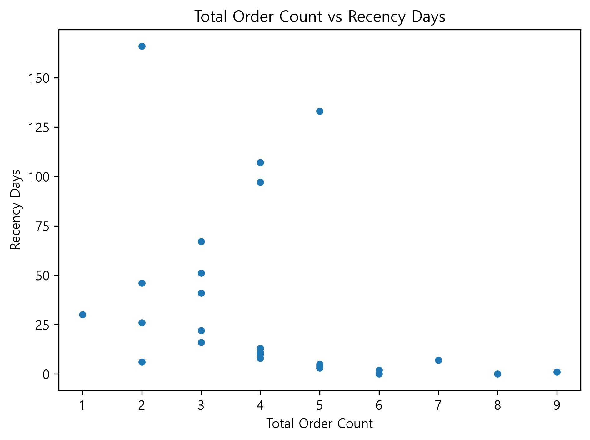
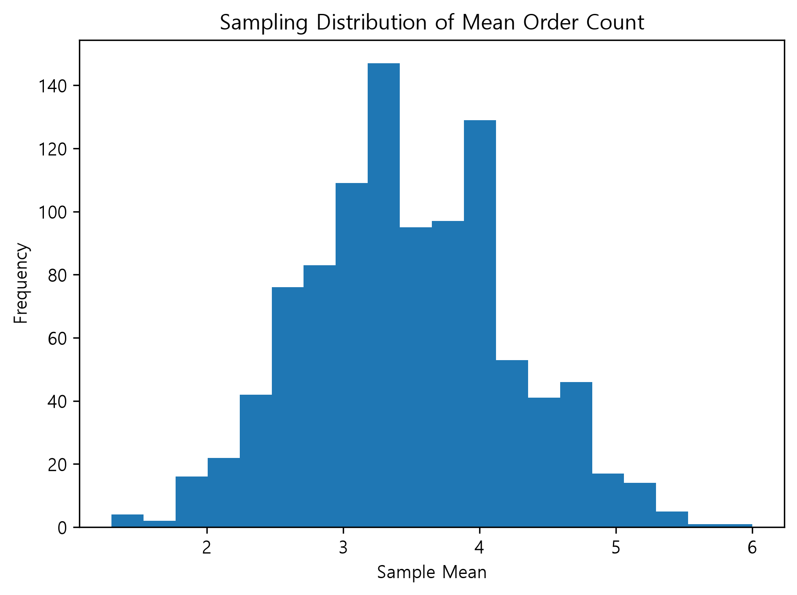
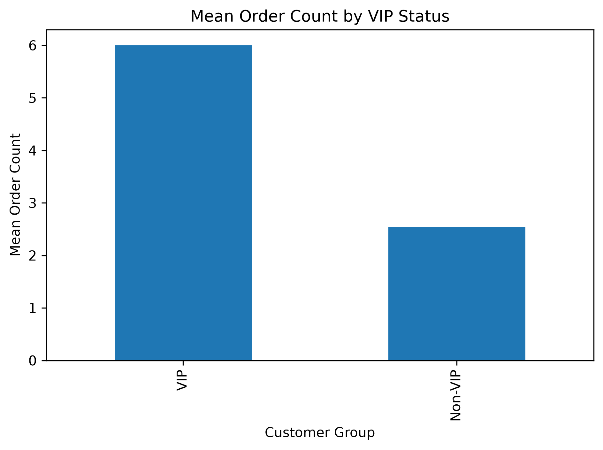
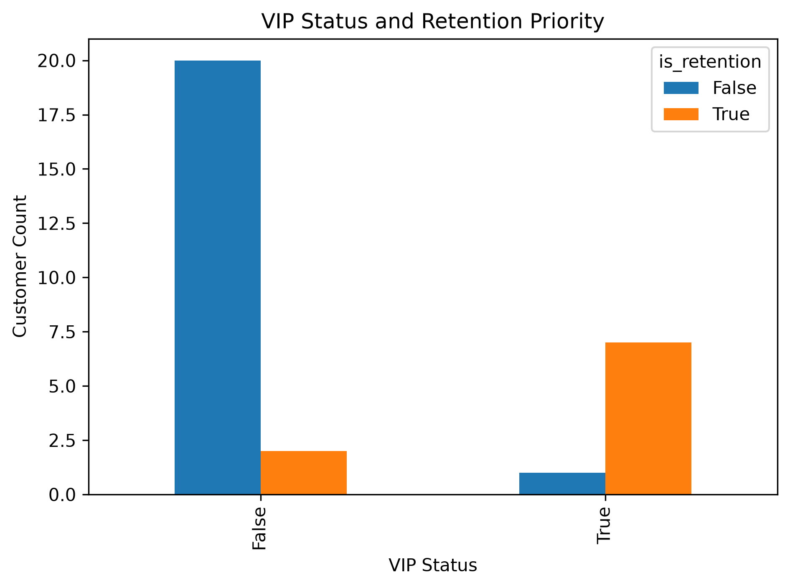

# 00 Foundation Review

> SQL, Python, pandas와 데이터 분석 기초를 다시 수행하고, 학습 내용을 재현 가능한 프로젝트 산출물로 정리하는 저장소입니다.

---

## 프로젝트 소개

이 프로젝트는 데이터 분석 직무 전환을 준비하면서 기존에 학습한 내용을 다시 수행하고, 단순 문법 연습을 SQL·Python·시각화·문서화가 연결된 프로젝트 형태로 재구성하는 것을 목표로 합니다.

주요 학습 과정은 다음과 같습니다.

- Python 기초 문법 복습
- pandas를 이용한 데이터 처리와 분석
- SQLite와 SQL을 이용한 데이터 조회 및 집계
- SQL과 Python 연동
- 데이터 검증과 시각화
- Git/GitHub를 이용한 버전 관리
- 분석 결과와 한계 문서화

---

## 프로젝트 목표

- SQL 기본 문법과 실무형 쿼리 작성 능력 강화
- Python 및 pandas 기초 재정립
- SQLite 데이터베이스와 Python 연동
- 분석 단위와 핵심 지표를 먼저 정의하는 습관 형성
- SQL 결과를 Python에서 검증하고 시각화
- 재현 가능한 데이터 준비 과정과 분석 코드 관리
- 향후 통계·머신러닝·포트폴리오 프로젝트의 기반 구축

---

## 사용 기술

- Python 3.13
- SQLite
- SQL
- pandas
- matplotlib
- Jupyter Notebook
- VS Code
- DB Browser for SQLite
- Git
- GitHub

---

## 프로젝트 구조

```text
00_foundation_review/
│
├── data/
│   ├── raw/
│   └── processed/
│
├── notebooks/
│   ├── 01_python_basics_rebuild.ipynb
│   ├── 02_customer_order_analysis.ipynb
│   ├── 03_sql_python_customer_summary.ipynb
│   ├── 04_sql_python_customer_order_analysis.ipynb
│   ├── 05_sql_python_customer_order_classification.ipynb
│   ├── 06_sql_python_customer_subquery_analysis.ipynb
│   ├── 07_sql_python_customer_order_window_analysis.ipynb
│   ├── 08_sql_python_customer_order_integrated_analysis.ipynb
│   ├── 09_sql_python_customer_order_mini_project.ipynb
│   ├── 10_customer_order_descriptive_statistics.ipynb
│   └── 11_customer_probability_distribution_analysis.ipynb
│
├── notes/
│   └── sql_customer_order_mini_project_report.md
│
├── outputs/
│   ├── customer_order_classification.csv
│   ├── customer_orders.csv
│   ├── customer_summary.csv
│   ├── customer_subquery_analysis.csv
│   ├── customer_order_window_analysis.csv
│   ├── customer_order_integrated_analysis.csv
│   ├── customer_order_mini_project.csv
│   ├── customer_management_summary.csv
│   ├── region_customer_count.png
│   ├── region_sales.png
│   ├── customer_order_count_vs_average.png
│   ├── customer_order_rank.png
│   ├── customer_activity_segment.png
│   ├── customer_management_action.png
│   ├── customer_order_descriptive_summary.csv
│   ├── customer_management_descriptive_summary.csv
│   ├── customer_order_count_histogram.png
│   ├── customer_order_count_boxplot.png
│   ├── customer_probability_summary.csv
│   ├── customer_order_probability_distribution.csv
│   ├── customer_grade_conditional_probability.csv
│   ├── customer_order_zscore.csv
│   ├── customer_order_probability_distribution.png
│   ├── customer_retention_probability_by_grade.png
│   └── customer_order_normal_comparison.png
│
├── sql/
│   ├── 01_sql_basics_review.sql
│   ├── 02_sql_customer_summary.sql
│   ├── 03_sql_customer_order_join.sql
│   ├── 04_sql_customer_order_classification.sql
│   ├── 05_sql_customer_subquery_analysis.sql
│   ├── 06_sql_customer_order_window_analysis.sql
│   ├── 07_sql_customer_order_integrated_analysis.sql
│   ├── 08_sql_retail_lab_day20_seed.sql
│   └── 09_sql_customer_order_mini_project.sql
│
├── src/
│   ├── __init__.py
│   └── kpi_utils.py
│
├── .gitignore
├── README.md
├── STUDY_LOG.md
└── requirements.txt
```

---

## 데이터베이스

### 기본 학습 DB

```text
D:/Study/SQL/database/retail_lab.db
```

### Day 20 확장 학습 DB

```text
D:/Study/SQL/database/retail_lab_day20.db
```

기존 DB는 고객 4명과 주문 4건으로 구성되어 있어 고객 순위, 재주문 간격, 최근성과 관리 대상 분류를 비교하기에 데이터가 부족했습니다.

원본 DB는 보존하고 별도의 확장 DB를 만들어 Day 20 SQL 미니 프로젝트에 사용했습니다.

확장 데이터 구성:

| 항목 | 값 |
|---|---:|
| 고객 수 | 30명 |
| 주문 수 | 104건 |
| 결제 주문 | 86건 |
| 취소 주문 | 18건 |
| 주문 기간 | 2025-11-25 ~ 2026-07-31 |
| 주문 이력이 없는 고객 | 5명 |

확장 데이터는 SQL 학습과 분석 연습을 위해 만든 가상 데이터입니다.

데이터 추가 과정은 다음 파일로 재현할 수 있습니다.

```text
sql/08_sql_retail_lab_day20_seed.sql
```

DB 파일 자체는 프로젝트 저장소에 포함하지 않고 로컬 데이터베이스 폴더에서 관리합니다.

---

## SQL Mini Project

### Customer Order Activity Analysis

고객별 주문 횟수, 주문 상태, 최근 주문 경과일과 평균 주문 간격을 분석해 고객 관리 대상을 분류했습니다.

### 문제 정의

고객 관리 담당자가 유지, 재활성화와 주문 문제 점검 대상의 우선순위를 정할 수 있도록 고객별 주문 활동을 고객 단위로 분석합니다.

### 분석 질문

1. 고객별 전체 주문 수는 몇 건인가?
2. 결제 주문과 취소 주문은 각각 몇 건인가?
3. 고객별 최초 주문일과 최근 주문일은 언제인가?
4. 고객의 평균 주문 간격은 며칠인가?
5. 데이터 기준일로부터 최근 주문 후 며칠이 지났는가?
6. 평균보다 주문 활동이 높은 고객은 누구인가?
7. 유지·재활성화·첫 구매 활성화·주문 문제 점검 대상은 누구인가?

### 분석 기준

- 사용 테이블: `customers`, `orders`
- 연결 키: `customer_id`
- 분석 단위: 고객 1명당 1행
- 기준일: `orders` 테이블의 최대 `order_date`
- 주문 상태: `paid`, `cancelled`

### 핵심 지표

- 전체 주문 수
- 결제 주문 수
- 취소 주문 수
- 결제율
- 최초 주문일
- 최근 주문일
- 고객 활동 기간
- 평균 주문 간격
- 최근 주문 경과일
- 전체 고객 평균 주문 수
- 주문 수 순위

### 관리 대상 분류

| 분류 | 기준 |
|---|---|
| `activation_candidate` | 주문 이력이 없는 고객 |
| `order_issue_review` | 취소 주문 수가 결제 주문 수보다 많은 고객 |
| `retention_priority` | 전체 고객 평균보다 주문 수가 많고 최근 30일 이내 주문한 고객 |
| `reengagement_candidate` | 최근 주문 후 60일이 지난 고객 |
| `general_management` | 위 조건에 해당하지 않는 고객 |

30일과 60일은 학습을 위해 정한 예시 기준이며 실제 업무 정책이 아닙니다.

### 핵심 결과

| 관리 대상 | 고객 수 |
|---|---:|
| `retention_priority` | 9명 |
| `order_issue_review` | 4명 |
| `reengagement_candidate` | 5명 |
| `activation_candidate` | 5명 |
| `general_management` | 7명 |
| **합계** | **30명** |

전체 고객의 평균 주문 수는 약 **3.47건**입니다.

활동 상태 분포:

| 활동 상태 | 고객 수 |
|---|---:|
| `recent` | 17명 |
| `cooling` | 3명 |
| `inactive_candidate` | 5명 |
| `no_order` | 5명 |



---

## Descriptive Statistics Analysis

### Customer Order Distribution Analysis

Day 20 SQL 미니 프로젝트에서 생성한 고객 단위 데이터를 이용해
고객 주문 횟수의 대표값, 산포도, 사분위수와 분포를 분석했습니다.

### 분석 질문

1. 전체 고객의 평균 주문 수와 중앙값은 얼마인가?
2. 가장 자주 나타나는 주문 횟수는 몇 건인가?
3. 고객 주문 수의 변동성은 어느 정도인가?
4. 고객 주문 수의 가운데 50%는 어느 범위에 있는가?
5. IQR 기준 잠재적 이상치가 존재하는가?
6. 관리 대상별 주문 횟수 분포는 어떻게 다른가?
7. 전체 평균 주문 수를 모든 고객에게 동일하게 적용해도 되는가?

### 분석 데이터

- 입력 파일: `outputs/customer_order_mini_project.csv`
- 분석 단위: 고객 1명당 1행
- 분석 고객 수: 30명
- 주요 분석 변수: `total_order_count`
- 고객 분류 변수: `management_action`

### 핵심 통계 결과

| 통계량 | 결과 |
|---|---:|
| 고객 수 | 30명 |
| 평균 주문 수 | 약 3.47건 |
| 중앙값 | 3.5건 |
| 최빈값 | 4건 |
| 표준편차 | 약 2.37건 |
| 최솟값 | 0건 |
| Q1 | 2건 |
| Q3 | 5건 |
| 최댓값 | 9건 |
| IQR | 3건 |
| IQR 기준 잠재적 이상치 | 0명 |

평균 주문 수와 중앙값이 비슷하므로 특정 고주문 고객 한 명이
전체 평균을 크게 왜곡하는 분포는 아니었습니다.

다만 고객별 주문 수는 0건에서 9건까지 분포하고
표준편차가 약 2.37건이므로 고객 간 주문 활동 차이는 존재합니다.

### 관리 대상별 평균 주문 수

| 관리 대상 | 평균 주문 수 |
|---|---:|
| `activation_candidate` | 0건 |
| `general_management` | 약 2.29건 |
| `order_issue_review` | 4건 |
| `reengagement_candidate` | 3.6건 |
| `retention_priority` | 6건 |

전체 평균 하나만으로 고객을 평가하기보다 주문 여부, 최근성,
주문 상태와 관리 대상별 분포를 함께 확인하는 것이 적절합니다.

### 고객 주문 수 분포



### 관리 대상별 주문 수 분포



### 분석 한계

- 분석 데이터는 학습을 위해 생성한 가상 데이터입니다.
- 고객 수가 30명으로 실제 고객 전체를 대표하지 않습니다.
- 주문 금액과 상품 정보가 없어 주문 횟수만 분석했습니다.
- 주문 횟수가 많다고 해서 고객의 매출 기여도가 높다는 뜻은 아닙니다.
- 기술통계는 현재 데이터의 모습을 요약하지만 차이의 원인이나 인과관계를 설명하지 않습니다.

---

## Probability and Distribution Analysis

### Customer Probability Analysis

고객 한 명을 임의로 선택한다는 관점에서
고객 주문 활동의 경험적 확률과 조건부확률을 계산했습니다.

### 주요 분석 질문

- 고객이 주문 이력을 가질 확률은 얼마인가?
- 고객이 retention_priority일 확률은 얼마인가?
- VIP 고객 중 retention_priority일 확률은 얼마인가?
- VIP와 retention_priority는 독립적인 사건인가?
- 고객 주문 수의 경험적 확률분포는 어떻게 나타나는가?
- 주문 수의 z점수는 고객의 상대적 위치를 어떻게 보여주는가?

### 핵심 결과

| 확률 | 결과 |
|---|---:|
| 주문 이력 있음 | 약 83.3% |
| 주문 이력 없음 | 약 16.7% |
| recent | 약 56.7% |
| retention_priority | 30.0% |
| VIP | 약 26.7% |
| retention_priority이면서 VIP | 약 23.3% |
| retention_priority이거나 VIP | 약 33.3% |
| VIP 조건에서 retention_priority | 87.5% |
| retention_priority 조건에서 VIP | 약 77.8% |

VIP 조건부 유지 우선 확률은 전체 유지 우선 확률보다 높게 나타났습니다.

하지만 조건부확률 차이는 연관성을 보여주는 결과이며,
VIP 등급의 인과효과를 증명하는 결과는 아닙니다.

### 주문 수 확률분포



### 등급별 유지 우선 조건부확률



### 실제 주문 분포와 정규곡선 비교



### 분석 한계

- 학습용 가상 데이터입니다.
- 고객 수가 30명으로 적습니다.
- 경험적 확률을 실제 전체 고객에게 일반화할 수 없습니다.
- 조건부확률이 높아도 인과관계를 의미하지 않습니다.
- 주문 수는 이산형이므로 정규분포가 정확한 모형은 아닙니다.

---

## Correlation Analysis

고객 주문 데이터의 주요 수치형 변수 사이의 관계를
공분산과 Pearson 상관계수를 이용해 분석했습니다.

총 주문 수, 결제 주문 수, 취소 주문 수, 결제율,
활동 기간, 평균 주문 간격, 최근 주문 경과일을 대상으로
상관계수 행렬과 산점도를 확인했습니다.

상관계수가 높더라도
total_order_count와 paid_order_count처럼
계산 구조 자체에서 연결되는 변수는
독립적인 고객 행동 관계와 구분하여 해석했습니다.

또한 현재 분석은 관찰 데이터의 연관성을 확인한 것이므로
상관관계만으로 인과관계를 주장하지 않습니다.

대표 시각화:



---

## Sampling and Statistical Inference

고객 주문 데이터를 이용하여 무작위 표본추출,
표본분포, 중심극한정리, 표준오차와 신뢰구간을 학습했습니다.

현재 30명의 가상 고객 데이터를 연습용 모집단으로 두고
반복 표본추출을 수행하여 표본평균의 분포를 확인했습니다.

표본 수가 증가할수록 평균 추정의 표준오차가 감소하는 것을
확인하고, 평균 주문 수를 점추정값뿐 아니라
95% 신뢰구간으로 표현했습니다.

현재 데이터는 실제 모집단에서 무작위 추출된 표본이 아니므로
계산된 신뢰구간을 실제 고객 모집단에 일반화하지 않습니다.

대표 시각화:



---

## Hypothesis Testing Analysis

VIP 고객과 Non-VIP 고객의 평균 주문 수를 비교하여
관측된 차이가 표본 변동만으로 설명할 수 있는 수준인지
Welch 독립표본 t검정으로 평가했습니다.

가설검정에서는 두 집단의 평균이 같다는 귀무가설을 설정하고,
p-value를 이용해 현재 데이터가 귀무가설과 얼마나
양립 가능한지 확인했습니다.

p-value만으로 결론을 내리지 않고
각 그룹의 고객 수, 평균, 표준편차와 실제 평균 차이를
함께 확인했습니다.

현재 데이터는 학습용 가상 데이터이며
실제 모집단에서 무작위 추출된 표본이 아니므로
검정 결과를 실제 고객 모집단에 일반화하지 않습니다.

또한 관찰된 평균 차이를
VIP 등급의 인과효과로 해석하지 않습니다.

대표 시각화:



---
## Chi-Square Independence Analysis

VIP 여부와 retention_priority 여부의 관계를
카이제곱 독립성 검정으로 분석했습니다.

두 범주형 변수의 교차표를 만들고,
실제 관측빈도와 두 변수가 독립일 때 예상되는
기대빈도를 비교했습니다.

카이제곱 통계량과 p-value뿐 아니라
기대빈도가 지나치게 작은 셀이 존재하는지도 확인하여
검정의 적용 한계를 함께 검토했습니다.

현재 데이터는 30명의 학습용 가상 고객 데이터이므로
소규모 기대빈도가 존재하는 경우
검정 결과를 강하게 일반화하지 않습니다.

또한 VIP 여부와 retention 분류 사이의 연관성을
인과관계로 해석하지 않습니다.

대표 시각화:



---

## 주요 SQL 기술

- `SELECT`, `WHERE`, `ORDER BY`
- 집계 함수와 `GROUP BY`
- `HAVING`
- `INNER JOIN`, `LEFT JOIN`
- `CASE WHEN`
- 조건부 집계
- Subquery
- `ROW_NUMBER`
- `RANK`, `DENSE_RANK`
- `LAG`, `LEAD`
- Window Function
- `julianday`를 이용한 날짜 차이 계산

---

## 주요 산출물

### 데이터 준비

- `sql/08_sql_retail_lab_day20_seed.sql`

### 최종 SQL 프로젝트

- `sql/09_sql_customer_order_mini_project.sql`

### SQL·Python 연동 분석

- `notebooks/09_sql_python_customer_order_mini_project.ipynb`

### 분석 결과

- `outputs/customer_order_mini_project.csv`
- `outputs/customer_management_summary.csv`
- `outputs/customer_management_action.png`

### 기술통계 분석

- `notebooks/10_customer_order_descriptive_statistics.ipynb`
- `outputs/customer_order_descriptive_summary.csv`
- `outputs/customer_management_descriptive_summary.csv`
- `outputs/customer_order_count_histogram.png`
- `outputs/customer_order_count_boxplot.png`

### 확률·확률분포 분석

- `notebooks/11_customer_probability_distribution_analysis.ipynb`
- `outputs/customer_probability_summary.csv`
- `outputs/customer_order_probability_distribution.csv`
- `outputs/customer_grade_conditional_probability.csv`
- `outputs/customer_order_zscore.csv`
- `outputs/customer_order_probability_distribution.png`
- `outputs/customer_retention_probability_by_grade.png`
- `outputs/customer_order_normal_comparison.png`

### 상관관계 분석

- `notebooks/12_customer_order_correlation_analysis.ipynb`
- `outputs/customer_order_covariance_matrix.csv`
- `outputs/customer_order_correlation_matrix.csv`
- `outputs/customer_order_pair_correlation_summary.csv`
- `outputs/customer_order_count_correlation_bar.png`
- `outputs/customer_order_count_vs_recency.png`
- `outputs/customer_order_count_vs_active_period.png`

### 추론통계 분석

- `notebooks/13_customer_order_sampling_inference.ipynb`
- `outputs/customer_order_sample_means.csv`
- `outputs/customer_order_standard_error_by_sample_size.csv`
- `outputs/customer_order_inference_summary.csv`
- `outputs/customer_order_sampling_distribution.png`
- `outputs/customer_order_standard_error_by_sample_size.png`

### 가설검정 분석

- `notebooks/14_customer_order_hypothesis_test.ipynb`
- `outputs/customer_grade_order_group_summary.csv`
- `outputs/customer_grade_order_ttest_result.csv`
- `outputs/customer_grade_order_mean_comparison.png`

### 카이제곱 독립성 분석

- `notebooks/15_customer_categorical_independence_test.ipynb`
- `outputs/customer_vip_retention_observed.csv`
- `outputs/customer_vip_retention_expected.csv`
- `outputs/customer_vip_retention_chi_square_result.csv`
- `outputs/customer_vip_retention_count.png`

### 분석 보고서

- `notes/sql_customer_order_mini_project_report.md`

### 학습 기록

- `STUDY_LOG.md`

---

## 결과 검증

최종 분석 결과는 다음 조건으로 검증했습니다.

- 최종 결과 행 수 = 전체 고객 수 30명
- 고객 ID 중복 수 = 0
- 고객별 전체 주문 수 합계 = 원본 주문 수 104건
- 결제 주문 수 = 86건
- 취소 주문 수 = 18건
- 주문 없는 고객의 주문 수 = 0건
- 주문 없는 고객의 날짜 및 최근성 지표 = 결측값

---

## 분석 한계

1. 추가한 고객과 주문 데이터는 학습용 가상 데이터입니다.
2. `orders` 테이블에 상품, 수량과 주문 금액이 연결되어 있지 않습니다.
3. 고객별 매출 기여도, 객단가와 수익성을 분석할 수 없습니다.
4. 고객 가입일이 없어 가입 후 첫 주문까지 걸린 기간을 계산할 수 없습니다.
5. 주문 취소 사유가 없어 취소가 많은 원인을 직접 확인할 수 없습니다.
6. 30일과 60일 기준은 학습용 업무 규칙입니다.
7. 최근 주문 공백만으로 고객 이탈을 확정할 수 없습니다.
8. 고객 관리 분류는 통계 모델이나 머신러닝 예측 결과가 아닙니다.
9. 캠페인의 실제 효과는 별도의 실험이나 통계 검증이 필요합니다.

---

## 진행 현황

| 분야 | 상태 |
|---|---|
| Python 기초 | ✅ 완료 |
| pandas 기초 | ✅ 완료 |
| SQLite 기초 | ✅ 완료 |
| SQL 조회·집계 | ✅ 완료 |
| JOIN·조건부 집계 | ✅ 완료 |
| Subquery | ✅ 완료 |
| Window Function | ✅ 완료 |
| SQL·Python 연동 | ✅ 완료 |
| SQL Mini Project | ✅ 완료 |
| Statistics | 🟢 기술통계·추론통계 기초 완료 |
| Machine Learning | ⚪ 학습 예정 |
| Portfolio Project | 예정 |

---

## 향후 학습 및 프로젝트

Foundation Review 이후에는 다음 단계로 확장할 예정입니다.

- 기초 통계와 가설 검정
- 고객 행동 지표 분석
- 고객 세분화
- 이탈 분석
- 매출 및 상품 분석
- 대시보드 프로젝트
- 포트폴리오용 통합 프로젝트

현재 DB에 주문 상품과 금액 데이터를 추가하면 다음 분석으로 확장할 수 있습니다.

- 고객별 구매금액
- 객단가
- 상품별 판매량
- 상품별 매출
- 고객별 수익 기여도
- RFM 분석

---

## 학습 기록

일자별 상세 학습 내용, 오류와 해결 과정은 `STUDY_LOG.md`에서 관리합니다.
